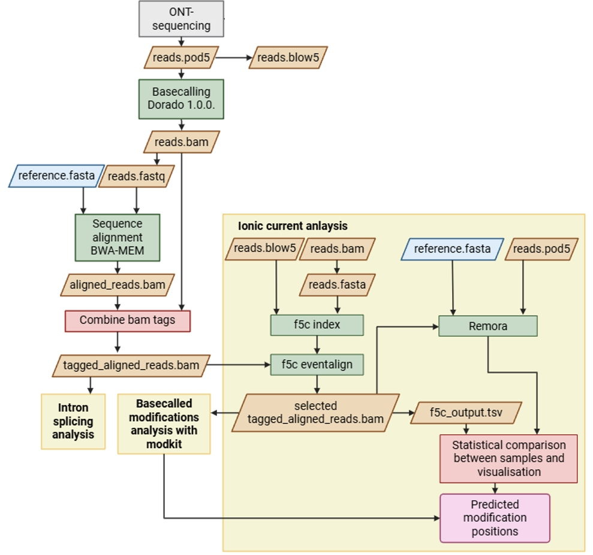

# tRNA modifications analysis
This repository provides a workflow for predicting modified positions within tRNAs using direct tRNA-sequencing. 



## Content:
1. [Dorado basecalling](#1-dorado-basecalling)
2. [Sequence alignment using BWA-MEM](#2-sequence-alignment-using-bwa-mem)
3. [Select only forward primary reads](#3-select-only-forward-primary-mapped-reads)
4. [Splicing event prevalence analysis](#4-splicing-event-prevalence-analysis)
5. [f5c signal alignment](#5-f5c-signal-alignment)
   
   5.1 [Preparation](#51-preparation)
   
   5.2 [f5c index](#52-f5c-index)
   
   5.3 [f5c eventalign](#53-f5c-eventalign)
   
   5.4 [Ionic current analysis](#54-ionic-current-analysis)
   
6. [Remora signal alignment](#6-remora-signal-alignment)
   
   6.1 [Preparation](#61-preparation)
   
   6.2 [Ionic current analysis](#62-ionic-current-analysis)
   
7. [Basecalled modification analysis](#7-basecalled-modification-analysis)
8. [Look for sequence mismatches](#8-look-for-sequence-mismatches)
9. [Visualise prediction results](#9-visualise-prediction-results)

## 1. Dorado basecalling
Optionally, the pod5 files created by ONT-sequencing can be merged together first or --recursive can be used. 
Make sure to use '--emit-moves' to save the initial signal mapping of the reads required for downstream analyses.
```
dorado basecaller \
   -r /path/to/pod5_directory \
   sup  \
  --modified-bases 2OmeG m5C_2OmeC inosine_m6A_2OmeA pseU_2OmeU \
  --emit-moves \
  --device cuda:all \
  -o reads.bam
```
In the current study Dorado version [1.0.0](https://github.com/nanoporetech/dorado/releases/tag/v1.0.0) is used. 

## 2. Sequence alignment using BWA-MEM
For sequence alignments we used [samtools version 1.20](https://github.com/samtools/samtools/releases/tag/1.20) and [BWA-MEM version 0.7.17 (r1188)](https://github.com/lh3/bwa/releases/tag/v0.7.17). 
Convert the bamfile with unaligned raw reads to fastq file:
```
samtools fastq reads.bam > reads.fastq
```
Do BWA-MEM alignment, using parameters recommended for tRNA-sequencing by [Lucas et al. (2023)](https://www.nature.com/articles/s41587-023-01743-6):
```
bwa mem -t 54 -W 13 -k 6 -x ont2d -T 20 reference.fasta reads.fastq > aligned_reads.sam
samtools view -bS aligned_reads.sam > aligned_reads.bam
samtools sort aligned_reads.bam > aligned_reads_sorted.bam
samtools index aligned_reads_sorted.bam
```
## 3. Select only forward primary mapped reads
For downstream analysis it is crucial to only use primary forward mapped reads, e.g. with flag 0.
```
grep ‘^@’ aligned_reads.sam > header.sam
samtools view -h aligned_reads.sam | awk ‘$2 == 0’ > reads_primary_without_header.sam
cat header.sam reads_primary_without_header.sam > reads_primary.sam
samtools view -bS reads_primary.sam > reads_primary.bam
samtools sort reads_primary.bam > reads_primary_sorted.bam
samtools index reads_primary_sorted.bam
```

## 4. Splicing event prevalence analysis
To select the reads which have known intron sequences, a [Bash script](filter_intron_containing_tRNA_reads.sh) is provided. This script can be used to facilitate counting the number of reads with introns in [Integrative Genomics Viewer (IGV)](https://igv.org/). 

## 5. f5c signal alignment
This is done following [f5c workflow](https://github.com/hasindu2008/f5c?tab=readme-ov-file#usage). The full documentation can be found [here](https://hasindu2008.github.io/f5c/docs/overview). 

### 5.1 Preparation
Convert the bamfile with unaligned raw reads to fasta file:
```
samtools fasta reads.bam > reads.fasta
```
The pod5 files need to be converted into blow5 files using [blue-crab tools](https://github.com/Psy-Fer/blue-crab):
```
blue-crab p2s [sequencing_run1].pod5 -o [sequencing_run1].blow5
```
This needs to be done per sequencing run. When having data from multiple sequencing runs, merging can be done subsequently using [slow5tools](https://github.com/hasindu2008/slow5tools):
```
slow5tools merge [sequencing_run1].blow5 [sequencing_run2].blow5 -o merged.blow5
```
### 5.2 f5c index
Create the required index files for f5c:
```
f5c index --slow5 merged.blow5 reads.fasta
```
### 5.3 f5c eventalign
Run f5c eventalign:
```
f5c eventalign \
   -r reads.fasta \
   -b reads_primary_sorted.bam \
   -g reference.fasta \
   --slow5 merged.blow5 \
   --rna \
   --pore rna004 \
   --print-read-names \
   --collapse-events \
   --min-recalib 10 \       # Lowered because of small tRNAs  
   --min-mapq . \           # Default is 20, optimal value depends on quality of input data
   --scale-events \         # to account for variation between nanopores
   --signal-index \         # Required to infer dwells in downstream analysis
   > f5c_eventalign.tsv
```
In addition to the command-line settings, some internal parameters are adjusted to relax the filtering for reads and adjust to the characteristics of the tRNA-sequencing data by explorative tuning:
- Threshold of [minimum logarithmic average of the emission probability](https://github.com/hasindu2008/f5c/blob/a88df46949148d2e82b431f745bef0c32a396637/src/align.c#L199) of a read to be aligned was lowered from the default -5.0 to-9.0 to ensure more reads are being used in the signal alignment.
- Threshold of the [number of events per base a read](https://github.com/hasindu2008/f5c/blob/a88df46949148d2e82b431f745bef0c32a396637/src/f5c.c#L799) is allowed to have is increased from 5.0 to 20.0, to ensure that poorer quality reads are not discarded.

### 5.4 Ionic current analysis 
Further downstream analysis of the f5c_eventalign.tsv file is described in the Python Jupyter notebook [F5c_ionic_current_analysis_tRNAs](F5c_ionic_current_analysis_tRNAs.ipynb). 
The notebook provides statistical comparison of ionic current levels per reference base positions between two samples (e.g. biological tRNAs vs. IVT-tRNAs) using Mann-Whitney-U test and visualisation of ionic current levels. This outputs a .csv file listing the reference positions predicted to differ significantly between the two samples and therefore predicted to be modified in the biological sample.
This notebook also describes how to obtain the read-IDs which are select by f5c and save them in a .txt file. To use the same selection of reads in downstream analyses, use:
```
samtools view -b -N selection_read_IDs.txt reads_primary_sorted.bam > selected_reads_primary.bam
```

## 6. Remora signal alignment
### 6.1 Preparation
[Remora](https://github.com/nanoporetech/remora) requires a bam file in which -mv tag (move table) is remained after sequence alignment. Because BWA-MEM alignment does not include this option, the required bam tags stored in the raw reads.bam are copied into the selected_reads_primary.bam which contains the sequence alignments, using the python script [bamfile_preparation_for_Remora](bamfile_preparation_for_Remora.py). This creates a selected_reads_primary_tagged.bam file suitable to apply Remora signal alignment:
```
python3 bamfile_preparation_for_Remora.py selected_reads_primary.bam -r reads.bam
```

### 6.2 Ionic current analysis
The signal alignment and further downstream analysis of ionic currents are described in the Python Jupyter notebook [Remora_ionic_current_analysis_tRNAs](Remora_ionic_current_analysis_tRNAs.ipynb). The notebook also provides statistical comparison of ionic current levels per reference base positions between two samples (e.g. biological tRNAs vs. IVT-tRNAs) using Mann-Whitney-U test and visualisation of ionic current levels. This outputs a .csv file listing the reference positions predicted to differ significantly between the two samples and therefore predicted to be modified in the biological sample.

## 7. Basecalled modification analysis
To make a comprehensive overview of the basecalled modifications, [modkit](https://github.com/nanoporetech/modkit) is used:
```
modkit pileup selected_reads_primary.bam  modkit_pileup.bed \
   --max-depth 1000000 \      # to ensure all the reads are used for calculating the filtering thresholds
   -n 1000000                  # to ensure all the reads are included
```
For the IVT-samples no modifications are expected, therefore the filtering thresholds are manually raised to 0.9 (`--filter-threshold 0.9`).
Further analysis is described in the Python Jupyter notebook [Basecalled_modifications_modkit_analysis_tRNAs](Basecalled_modifications_modkit_analysis_tRNAs.ipynb).

## 8. Look for sequence mismatches
Sequence mismatches are analysed by using the coverage track of IGV with a coverage allele-fraction threshold (quality weighted) of 0.2. This needs to be reported manually in a .csv file with column names 'Position' and 'Percentage mismatch'.

## 9. Visualise prediction results
To compare the results of the ionic current analyses followed by f5c's and Remora's signal alignment, the modification basecalled by Dorado and the positions with sequence mismatches, heatmap can be made per tRNA of interest. This is described in the Python Jupyter notebook [Heatmaps_statistics_comparison_f5c_Remora](Heatmaps_statistics_comparison_f5c_Remora.ipynb).

In addition, the signal coverage and dwells of the generated signal alignments by f5c and Remora can be analysed using the Python Jupyter notebook [Signal_alignment_comparison_f5c_Remora](Signal_alignment_comparison_f5c_Remora.ipynb).


<br><br><br>
This pipeline is created as part of Master Research Project by Isis van Loenen.
