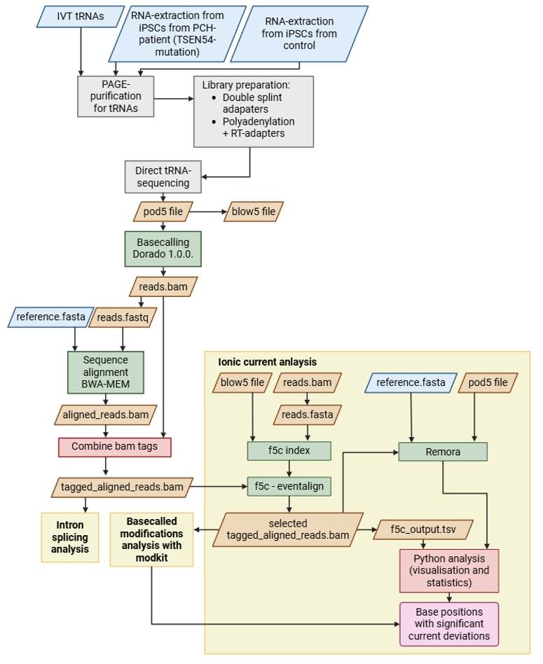

# tRNA modifications analysis
This repository provides a workflow for predicting modified positions within tRNAs using direct tRNA-sequencing.



Steps:
1. [Dorado basecalling](#1-dorado-basecalling)
2. [Sequence alignment using BWA-MEM](#2-sequence-alignment-using-bwa-mem)
3. [Select only forward primary reads](#3-select-only-forward-primary-reads)
4. [Splicing event prevalence analysis](#4-splicing-event-prevalence-analysis)
5. F5c signal alignment
   
   a. f5c index
   
   b. f5c eventalign
   
   c. Ionic current analysis
   
7. Remora signal alignment
   
   a. Prepare bam file
   
   b. Ionic current analysis
   
9. Basecalled modification analysis
10. Look for sequence mismatches
11. Visualise prediction results

## 1. Dorado basecalling
The pod5 files created by ONT-sequencing can be merged together first:
```
dorado basecaller \
  sup [...].pod5 \
  --modified-bases 2OmeG m5C_2OmeC inosine_m6A_2OmeA pseU_2OmeU \
  --emit-moves \
  --device cuda:all \
  -o reads.bam
```
In the current study Dorado version [1.0.0](https://github.com/nanoporetech/dorado/releases/tag/v1.0.0) is used. 

## 2. Sequence alignment using BWA-MEM
Convert the bamfile with unaligned raw reads to fasta file:
```
samtools fastq reads.bam > reads.fastq
```
Do BWA-MEM alignment, using parameters optimised for tRNA-sequencing:
```
bwa mem -t 54 -W 13 -k 6 -x ont2d -T 20 reference.fasta reads.fastq > aligned_reads.sam
samtools view -bS aligned_reads.sam > aligned_reads.bam
samtools sort aligned_reads.bam > aligned_reads_sorted.bam
samtools index aligned_reads_sorted.bam
```
## 3. Select only forward primary mapped reads
For downstream analysis it is crucial to only use primary forward mapped reads, e.g. with flag 0.
```
grep ‘^@’ aligned_reads.sam > header.sam
samtools view -h aligned_reads.sam | awk ‘$2 == 0’ > reads_primary_without_header.sam
cat header.sam reads_primary_without_header.sam > reads_primary.sam
samtools view -bS reads_primary.sam > reads_primary.bam
samtools sort reads_primary.bam > reads_primary_sorted.bam
samtools index reads_primary_sorted.bam
```

## 4. Splicing event prevalence analysis
To select the reads which have known intron sequences, a [Bash script](filter_intron_containing_tRNA_reads.sh) is provided.
